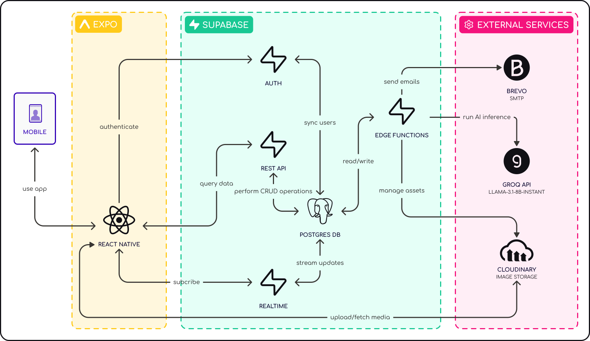
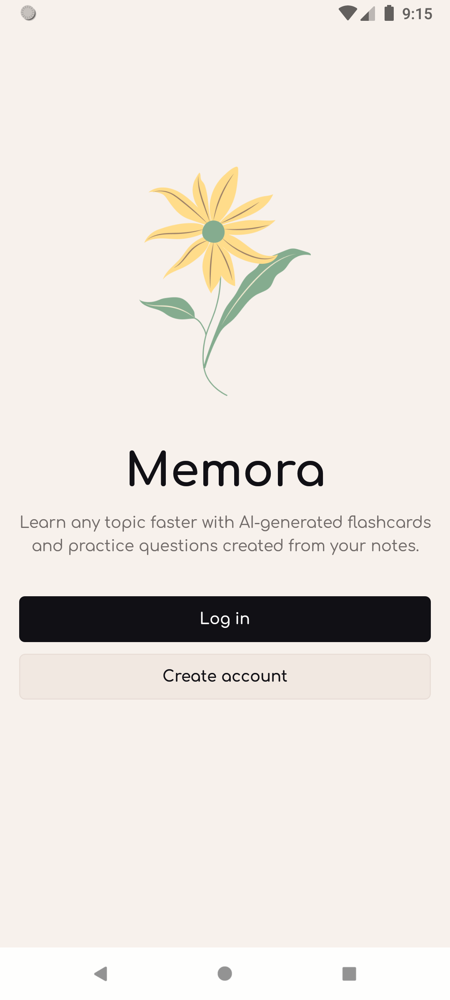
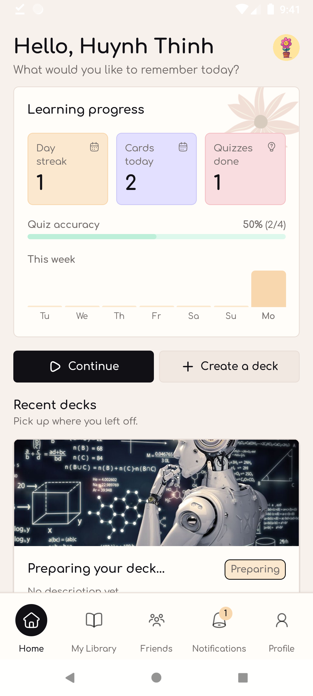
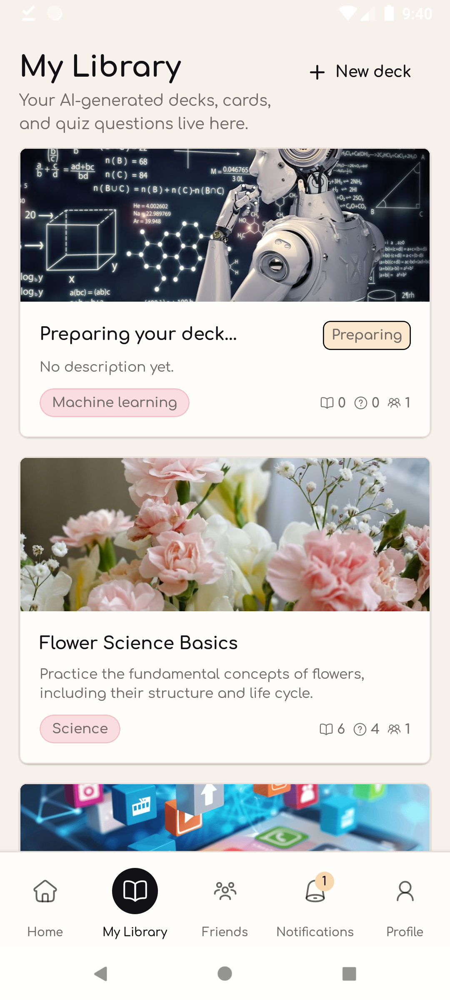
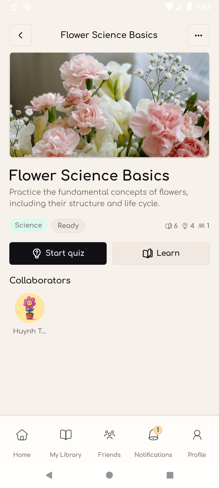
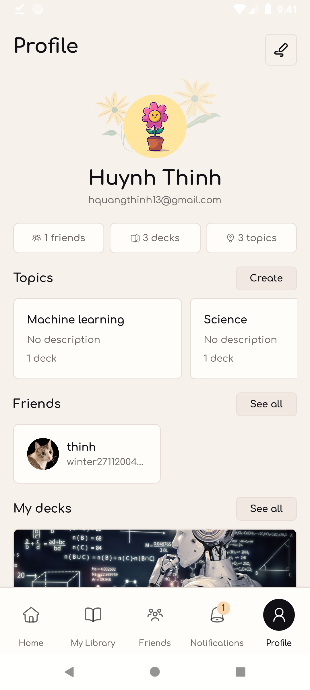
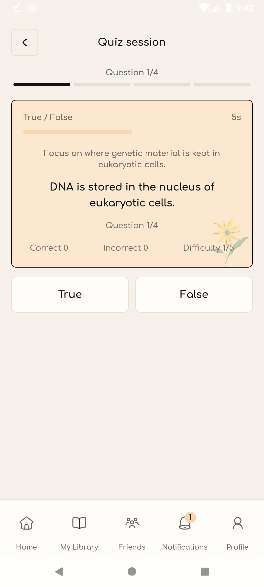
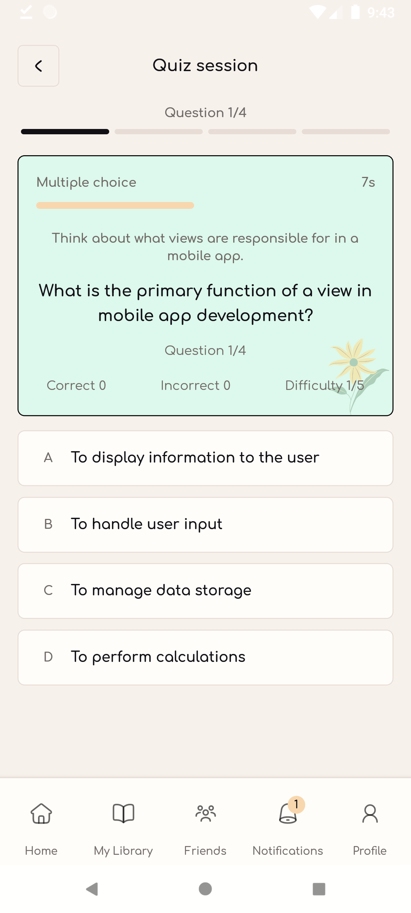
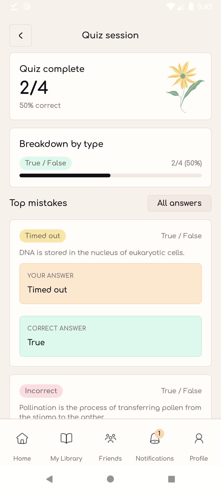

# Memora: AI-powered Flashcards & Quizzes

<table style="border: none;">
<tr style="border: none;">

<td style="border: none;">

Memora is an AI-powered mobile learning app that transforms users’ notes and study materials into interactive flashcards and quizzes.

Designed to make studying more engaging and collaborative, Memora helps learners organize knowledge into decks, review concepts efficiently, and build consistent learning habits through smart study experiences.

</td><td style="border: none;">

</td>
</tr>
</table>

<table style="border: none;">
<tr style="border: none;">
<td style="border: none;">

</td>
<td style="border: none;">

Users can:

- Generate flashcards and quizzes from text notes
- Organize study decks by topics
- Review concepts with interactive flashcards
- Study through quiz sessions, including true/false and multiple-choice questions
- Collaborate on decks with friends

</td>
</tr>
</table>

## Key Features

- **AI-powered deck generation** — Generate flashcards and quizzes automatically from users’ notes and study materials.
- **Interactive learning experience** — Study with flashcards, multiple-choice quizzes, and true/false sessions.
- **Supabase Realtime integration** — Track deck processing status in real time while waiting for AI-generated content.
- **Cloudinary image storage** — Upload and manage deck cover images with cloud-based media storage.
- **Authentication & email services** — Secure email-based authentication and OTP flows powered by Supabase Auth.
- **Collaborative study decks** — Invite friends to collaborate and study together on shared decks.
- **Consistent pastel UI system** — Carefully designed mobile-first UI with reusable components and a cohesive visual language.

## Tech Stack

### Core

### Backend & Database

### Styling & UI

### Services

## System Architecture

## Demo

  
  
  

  
  
  

  
  
  

